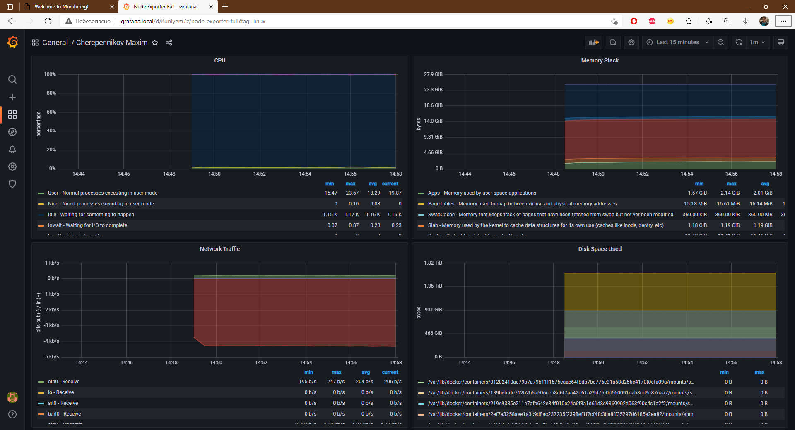
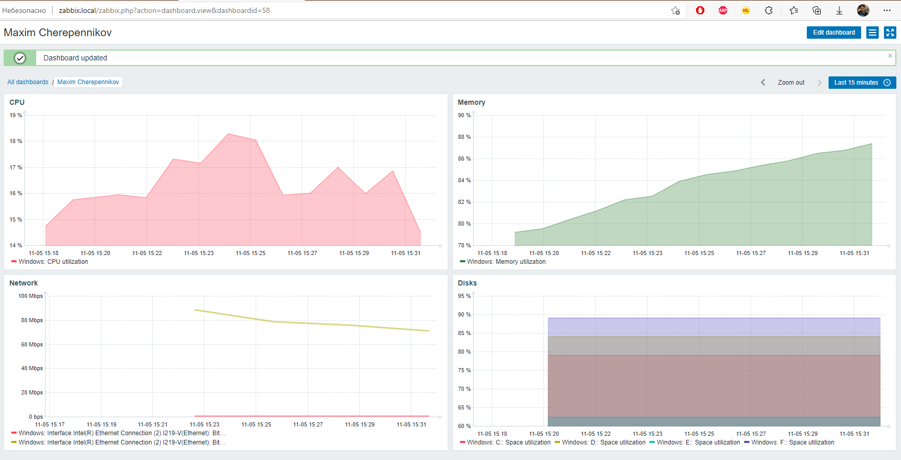

# Мониторинг

* [Monitoring](https://github.com/maxonchikbk/geekbrains/tree/master/homework/Monitoring)

## Grafana

## Zabbix

---
# Домашнее задание

Настроить дашборд с 4-мя графиками

    память;
    процессор;
    диск;
    сеть.

Настроить на одной из систем:

    * zabbix (использовать screen (комплексный экран);
    * prometheus - grafana.

В качестве результата прислать скриншот экрана - дашборд должен содержать в названии имя приславшего.

