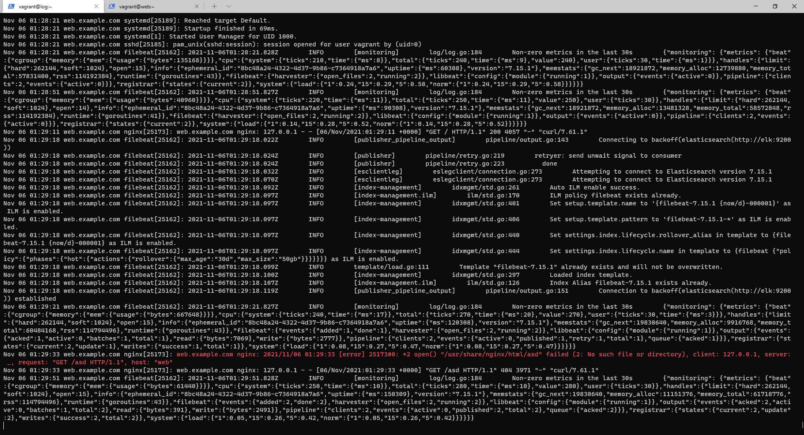
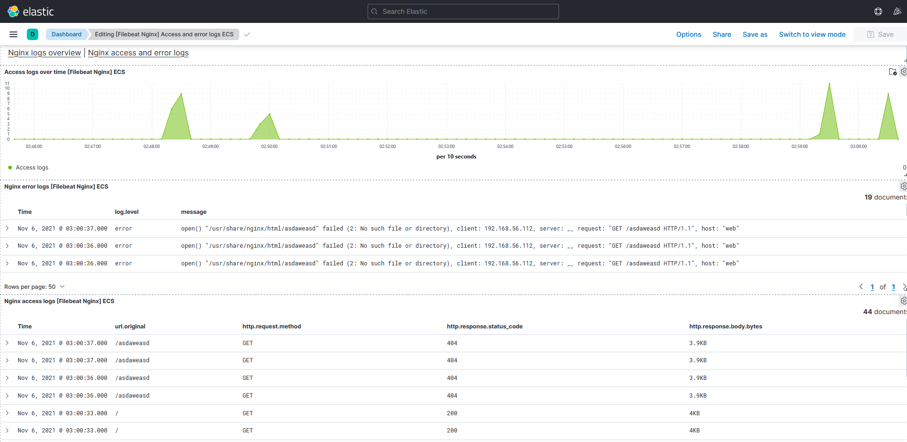

* [Vagrantfile](https://github.com/maxonchikbk/otus/blob/main/16.Logging/Vagrantfile)

## journald
На log запускаем __sudo journalctl -D /var/log/journal/remote --follow__ и смотрим логи с web

## ELK

# Домашнее задание

1. Настраиваем центральный сервер для сбора логов

    * в вагранте поднимаем 2 машины web и log
    * на web поднимаем nginx
    * на log настраиваем центральный лог сервер на любой системе на выбор:
        - journald;
        - rsyslog;
        - elk.

    * настраиваем аудит, следящий за изменением конфигов нжинкса

2. Все критичные логи с web должны собираться и локально и удаленно. Все логи с nginx должны уходить на удаленный сервер (локально только критичные). Логи аудита должны также уходить на удаленную систему.

Формат сдачи ДЗ - vagrant + ansible:
* развернуть еще машину elk
* таким образом настроить 2 центральных лог системы elk и какую либо еще;
* в elk должны уходить только логи нжинкса;
* во вторую систему все остальное.